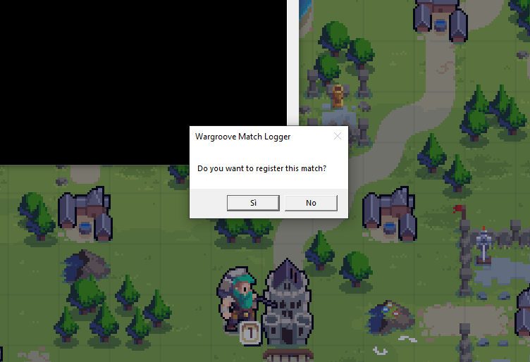
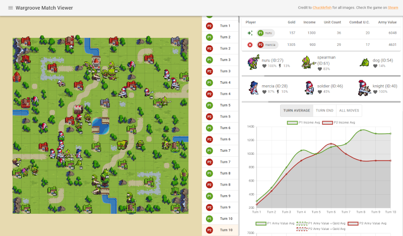
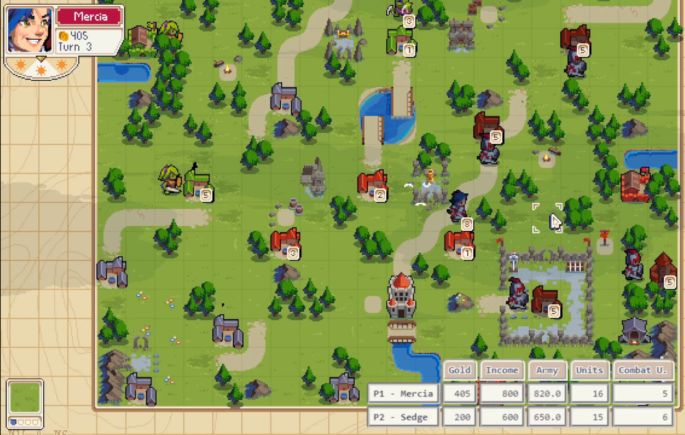

# Wargroove Match Logger 1.6.0

A mod for Wargroove.
It saves matches as files locally or online. They can later be opened with the [Wargroove Match Viewer](https://wgroove.tk) to be replayed, analyzed etc.

The mod is packed in 2 different types:
- official mod
- unofficial mod

||Official|Unofficial|
|-|-|-|
|Easy to install|Yes|No
|Register local and<br>online matches|Yes|Yes
|Can be used as spectator|No|Yes
|Works even if just one person<br>has it installed|No|Yes
|Automatically enabled<br>for all matches|No|Yes*

(* you can still choose not to record the match when the game starts)


## Download
Downloaded the lateset releases [here](https://github.com/gp27/wargroove-match-logger/releases)

## Installation
### Official mod
Downlod the offical mod, unzip it and place it in:

`C:\Users\[your-user]\%appdata%\Roaming\Chucklefish\Wargroove\mods`

After the mod is installed, you can enable it when you create a local or multiplayer match. All the players need to have the same version of the official mod installed to join the game.

### Unofficial mod
Download the unoffical mod `.hmd` file.
To install the unofficial mod you also need to download the [**Unoffical mod packer**](https://www.nexusmods.com/wargroove/mods/1) and use it to apply mod file to your game (follow the instructions on nexusmods)

## How does it work?
To register a match:
- if you are using the offical mod, you just need to enable it when you create the local/online match
- if you are using the unoffical mod, you will get a prompt asking if you want to register, when you start a match.



If you are playing online, you will also get a prompt to `Share the match online`. If you enable it, your browser will open and you can share the link in the address bar with anyone who wants to see the "live" replay

When a match is registered, a file `.json` with a unique name will be created in the `matches` folder, under the Wargroove install directory:

`C:\Program Files (x86)\Steam\steamapps\common\Wargroove\matches\`

The file is updated every time a player makes a move.

You can drag and drop the file on https://wgroove.tk to view the match.



If you choose to `Share the match online` a command line window will open when you start the match. You can minimize this window, but if you close it the online match will stop being updated (the local copy will still be saved correctly).

If a match is shared online you can just refresh the browser tab in the match viewer to see the latest moves. You can also share the link with anyone and it will work for them as well.
The shared version is goint to be updatetd at every move, if you are registering the match as one of the playing players, or at the start of every turn if you are registering as a spectator.

## Settings
You can configure some mod settings by ceating the file

`C:\Program Files (x86)\Steam\steamapps\common\Wargroove\wgml-settings.txt`
```
live_stats = true
no_prompts = false
debug = false
```

## Fog of war
Fog of war matches can be registered, but both the local `.json` file and the and the online saved match will appear only after the match has ended, to prevent cheating.

## Live Stats for Streamers
If you enable live stats in the mod settings, the following file will be created and updated while registering matches:

`C:\Program Files (x86)\Steam\steamapps\common\Wargroove\wgml-live-stats.html`

You can then add the file as a streaming source in software like OBS.



The URL that you need to insert in OBS should be formatted like this:

`file:///C:\Program Files (x86)\Steam\steamapps\common\Wargroove\wgml-live-stats.html?show=`

You can append some comma separated values to `?show=` to choose what kind of data you want to show. The available options are:

- `current_stats`
- `chart_income`
- `chart_army`
- `chart_unit_count`
- `chart_combat_uc` (Combat Unit Count)

It is possible to modify all chart values in the following way:

- `chart_income:avg` (shows the Turn Average chart; default )
- `chart_income:turn` (show the End of Turn chart)
- `chart_income:mov` (show the All Moves chart)

#### Example
The link to show the current stats table and the ArmyValue Turn Average chart:

`file:///C:\Program Files (x86)\Steam\steamapps\common\Wargroove\wgml-live-stats.html?show=current_stats,chart_army:avg`

#### Warning
`wgml-live-stats.html` won't show anyting regardless of how you set the link unless a match is currently being recorded


## Requirements
- cURL - It should be preinstalled on Windows 10 (build >= 17063). Alternatively you can download it ([cURL](https://curl.se/windows/)) and place it in `C:\Windows\System32\`

## Related
### [Wargroove Match Viewer](https://wgroove.tk)
#### [Wargroove Match Viewer (Github)](https://github.com/gp27/wargroove-match-viewer)
